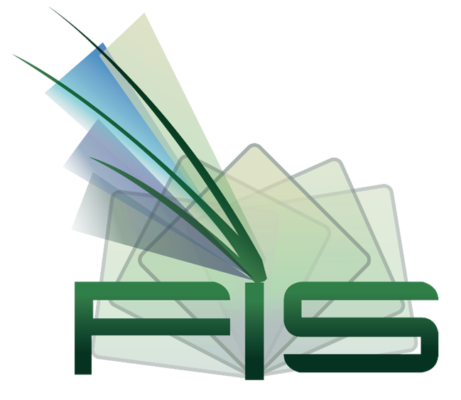

<h1>ESCUELA POLITÉCNICA NACIONAL</h1>
<h2> FACULTAD DE INGENIERÍA DE SISTEMAS </h2>
<h2> INGENIERÍA EN SOFTWARE </h2>

---

**PERÍODO ACADÉMICO:** 2024-A 
**ASIGNATURA:** USABILIDAD Y ACCESIBILIDAD 
**GRUPO:** GR1SW 
**Docente:** Tania Calle 

---
**TIPO DE INSTRUMENTO:** Practica 
**TÍTULO:** Principio Perceptible y Operable 
**FECHA DE ENTREGA:** 01 de agosto de 2024 
**Nombre:** 

- Chalacama Erick

---

**Práctica**
- Realizar una pagina Web de algún emprendimiento que ustedes
quieran transmitir
- La pagina debe tener títulos, subtítulos, texto, imágenes, una tabla y
un video donde ustedes promocionen los productos.
- Su pagina web debe ser perceptible y operable.
- Recuerde que cada dato no textual debe tener una alternativa de
texto.
- Recuerde que para navegar por el teclado debe utilizar el comando
tabindex.